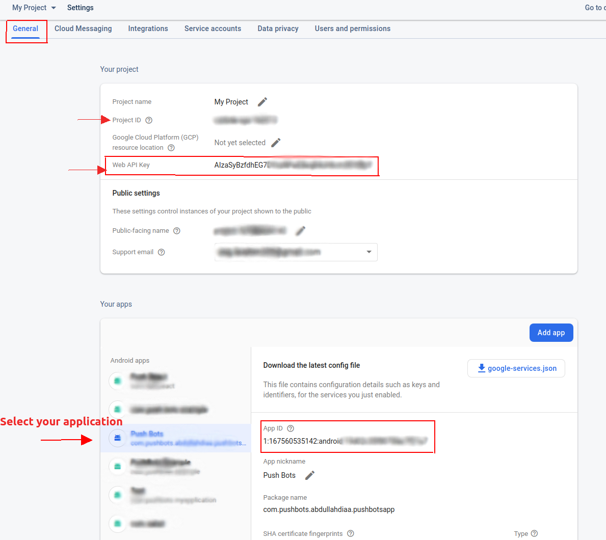

# PushBots Flutter SDK

A library for Dart developers. Help you manage notifications easily and effectively.

## Usage


Use this package as a library

**1- Depend on it**

Add this to your package's `pubspec.yaml` file:


````
dependencies:
  pushbots_flutter: ^1.0.0-beta2
````


**2- Install it**

You can install packages from the command line:

with Flutter:


````
$ flutter pub get
````

Alternatively, your editor might support flutter pub get. Check the docs for your editor to learn more.


**3- Import it**

Now in your Dart code, you can use:

````
import 'package:pushbots_flutter/pushbots_flutter.dart';
````


### Android Setup

Add to `defaultConfig` section, then replace `PUSHBOTS_APP_ID` and `GOOGLE_SENDER_ID`


````
defaultConfig {
        // Add PushBots integration data
        manifestPlaceholders = [
                pushbots_app_id               : "YOUR_APP_ID",
                pushbots_loglevel             : "DEBUG",
                google_sender_id              : "YOUR_SENDER_ID"
        ]

    }

````


### Flutter Usage


Once added `pushbots_flutter` into your `pubspec.yaml`.

#### Initializing PushBots:-


You can start by initializing the `PushBotsFlutter` by calling **`PushbotsFlutter.initialize("PUSHBOTS_APPLICATIONID", "YOUR_WEBAPI_KEY", "YOUR_FCM_APP_ID", "YOUR_PROJECT_ID");`**





Listen for notifiers (receive, open) notifications:-


````
 PushbotsFlutter.listenForNotificationReceive().stream.listen((onData) {
      print("MAIN, received: " + onData.toString());
    });

 PushbotsFlutter.listenForNotificationOpen().stream.listen((onData){
      print("MAIN, opened: " + onData.toString());
    });
````


Update User info:-


````
PushbotsFlutter.setName("Pushbotter");
PushbotsFlutter.setFirstName("FirstName");
PushbotsFlutter.setLastName("LastName");
PushbotsFlutter.setEmail("email@email.com");
PushbotsFlutter.setAlias("Alias");
PushbotsFlutter.setPhone("phoneNumber");


````
Other Methods: 
````
PushbotsFlutter.debug(true);
//Track event
PushbotsFlutter.trackEvent("added_to_cart");

//ShareLocation with prompting
PushbotsFlutter.shareLocation(true);

//unsubscribe user from receiving notifications
PushbotsFlutter.toggleNotifications(false);

PushbotsFlutter.setTags(["tag1", "tag2"]);

PushbotsFlutter.removeTags(["tag1"]);

//  ---- iOS 
//Set log level with alert
//Log Levels :  noLog, error, warn, info, verbose
PushbotsFlutter.setLogLevelWithUI(LogLevels.verbose.index,true);
//Reset Badge
PushbotsFlutter.resetBadge();
//Set badge
PushbotsFlutter.setBadge(10);
//Increment badge count
PushbotsFlutter.incrementBadgeCountBy(1);
//Decrement badge count
PushbotsFlutter.decrementBadgeCountBy(10);


````


## Feature and bugs

Please fill issue on https://github.com/pushbots or https://stackoverflow.com/questions/tagged/pushbots
